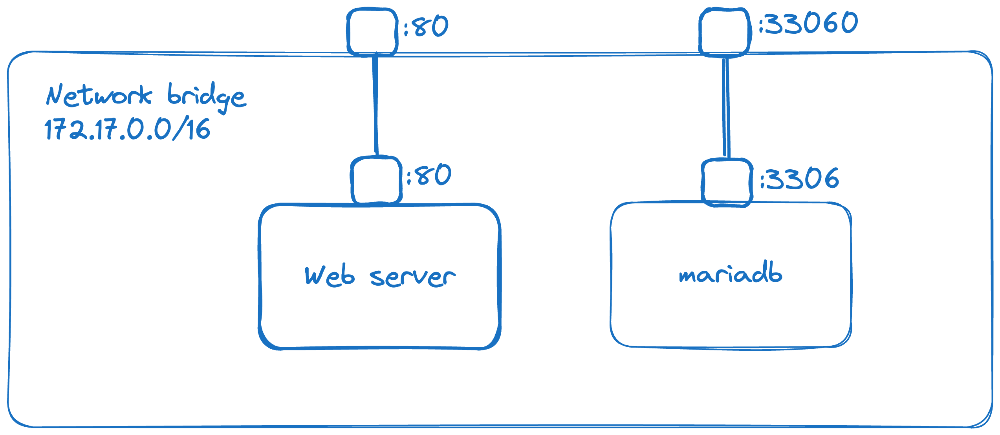
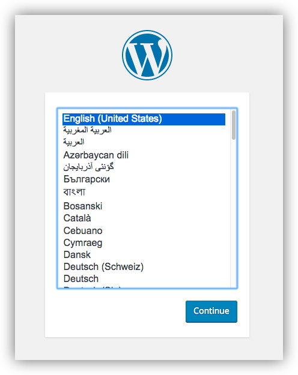
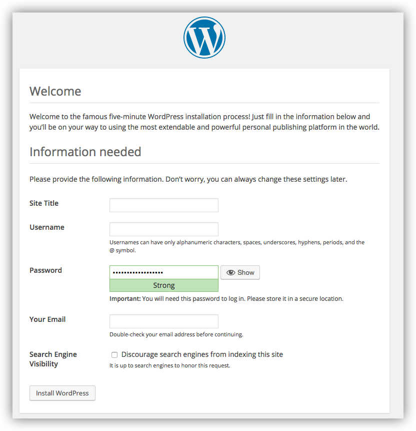

## Getting Started

### Target Architecture



### Prerequisites

You need Docker and Docker Compose installed:

```bash
sudo apt-get update
sudo apt install docker docker-compose -y
sudo usermod -aG docker $USER
docker ps
docker run hello-world
docker-compose version
```

> **Note:**
>
> Check the [official Docker documentation](https://docs.docker.com/engine/install/ubuntu/) for the most up-to-date installation steps for your system.


### Installation

The `docker-compose.yml` file specifies the containers, network configuration, environment variables, and persistent storage. Adapt the configuration to your needs.

> **Notes:**
>
> - Docker volumes `db_data` and `wordpress_data` retain database updates, themes, and plugins installed through WordPress. [Learn more about Docker volumes](https://docs.docker.com/storage/volumes/).
> - WordPress Multisite works only on ports 80 and 443.

Place yourself in the directory containing the `docker-compose.yml` file.

> **Caution:**
> Modify the following environment variables before running Docker Compose:

| Variable                | Default Value |
| ----------------------- | ------------- |
| MYSQL\_ROOT\_PASSWORD   | somewordpress |
| MYSQL\_DATABASE         | wordpress     |
| MYSQL\_USER             | wordpress     |
| MYSQL\_PASSWORD         | wordpress     |
| WORDPRESS\_DB\_HOST     | db            |
| WORDPRESS\_DB\_USER     | wordpress     |
| WORDPRESS\_DB\_PASSWORD | wordpress     |
| WORDPRESS\_DB\_NAME     | wordpress     |

Run the following command to start the containers:

```bash
docker compose up -d
```

This runs [`docker compose up`](https://docs.docker.com/engine/reference/commandline/compose_up/) in detached mode, pulls the required Docker images, and starts the WordPress and database containers, as shown below:

```bash
Creating network "my_wordpress_default" with the default driver
Pulling database (mysql:5.7)...
5.7: Pulling from library/mysql
efd26ecc9548: Pull complete
a3ed95caeb02: Pull complete
...
Digest: sha256:34a0aca88e85f2efa5edff1cea77cf5d3147ad93545dbec99cfe705b03c520de
Status: Downloaded newer image for mysql:5.7
Pulling wordpress (wordpress:latest)...
latest: Pulling from library/wordpress
efd26ecc9548: Already exists
a3ed95caeb02: Pull complete
589a9d9a7c64: Pull complete
...
Digest: sha256:ed28506ae44d5def89075fd5c01456610cd6c64006addfe5210b8c675881aff6
Status: Downloaded newer image for wordpress:latest
Creating my_wordpress_database_1 ... done
Creating my_wordpress_wordpress_1 ... done
```

> **Note:**
> If WordPress Multisite is enabled, it only works on ports 80 and/or 443. If you encounter a port binding error, ensure that no other service is using these ports.


### Accessing WordPress in a Web Browser

At this stage, WordPress should be running on port 80 of your Docker host. Open `http://localhost:80` in a web browser to complete the famous "five-minute installation" as a WordPress administrator.

> **Note:**
> The WordPress site may take a few minutes to become available on port 80 as the containers initialize.

If you are using Docker Desktop for Mac or Windows, you can also access the site via `http://localhost`.





## Usage

Your blog should now be online with its first page!

## Sources

- [Docker Engine Installation Guide](https://docs.docker.com/engine/install/ubuntu/)